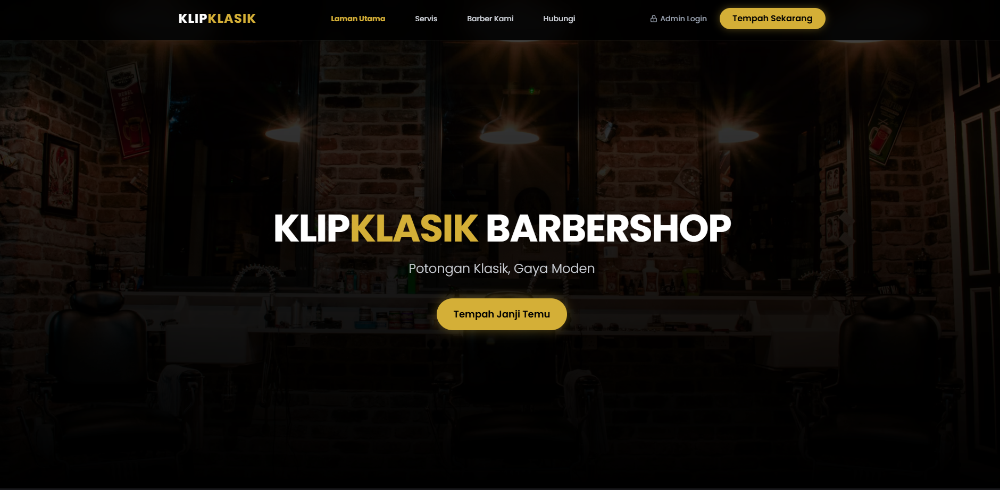
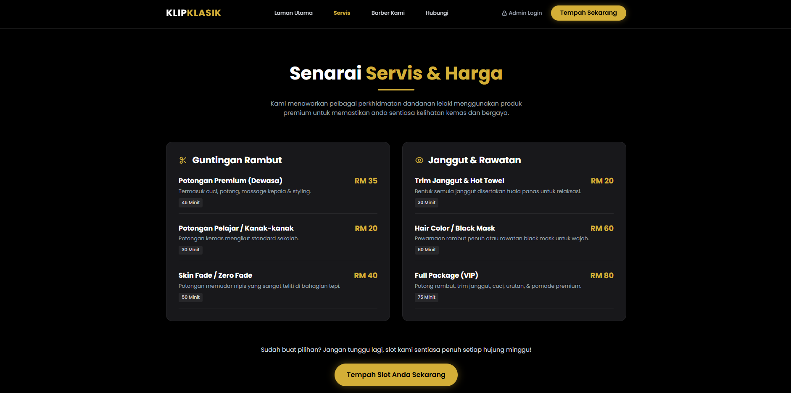
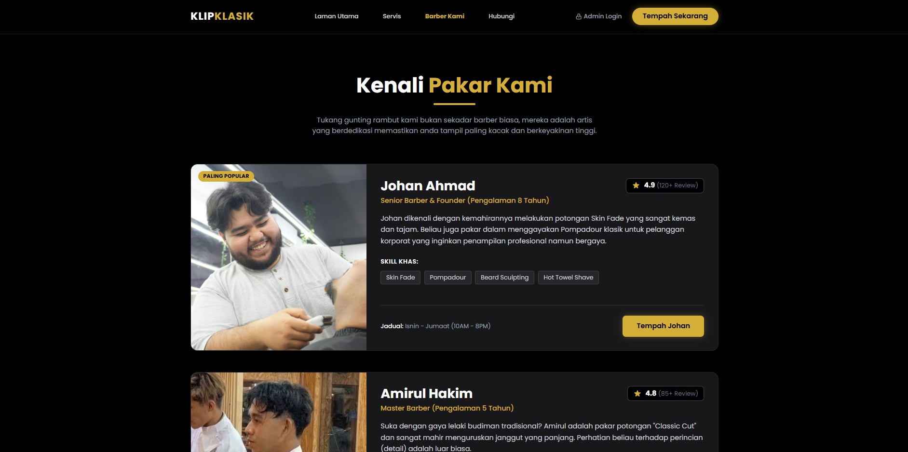
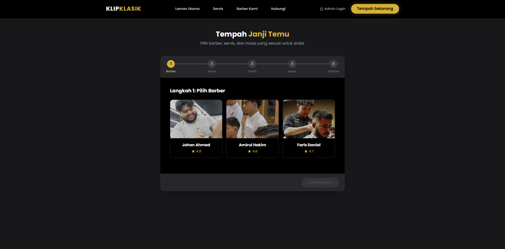
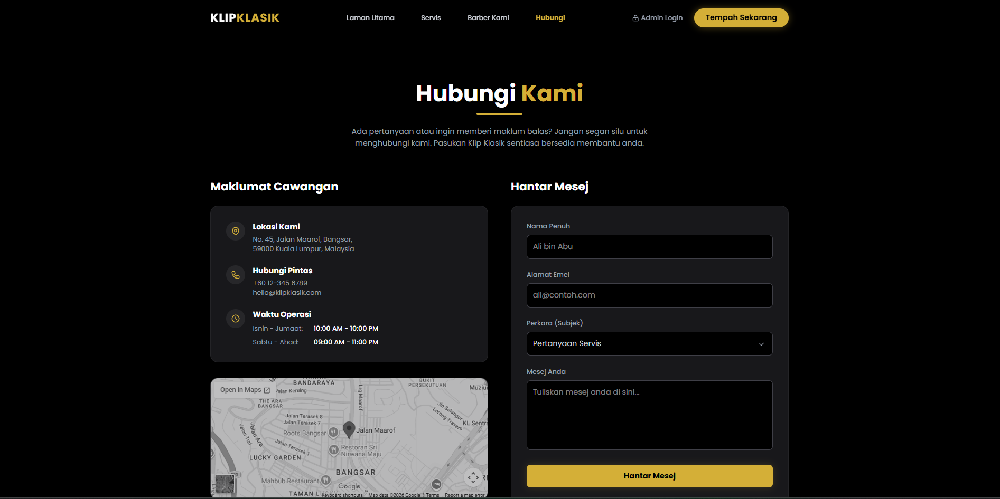
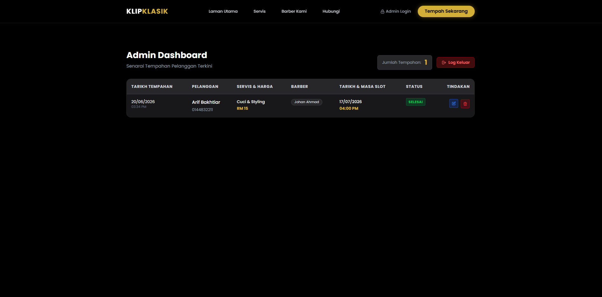
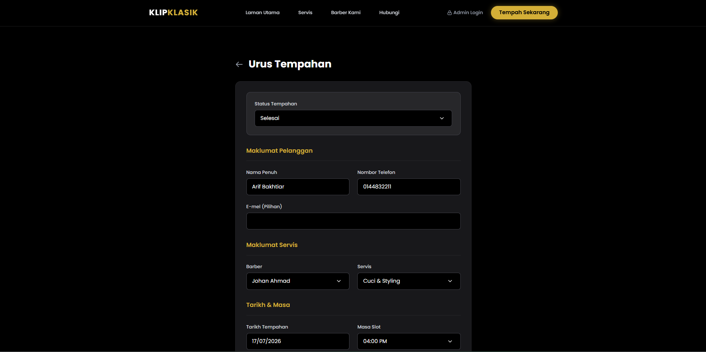

# 💈 Clip Classic Barbershop System

A comprehensive web-based barbershop booking and management system built with Laravel 12, SQLite, and modern web technologies. This system enables barbershop owners and customers to interact seamlessly in scheduling and managing grooming appointments with a premium 'Black & Gold' aesthetic.


## 🌟 Features

### 🎯 Core Functionality

- **Multi-role Architecture** (Admin & Public Users)
- **Premium User Interface** with micro-animations
- **Interactive Google Maps** Integration
- **Real-time Booking System** with availability management
- **Mobile-First Responsive Design**

### 👨‍💼 Admin Features

- **Secure Authentication System**
- **Centralized Booking Dashboard**
- **Booking Management** (Approve, Edit, Modify Date/Time, Cancel)
- **Customer Data Management**
- **Status Tracking** (Pending, Completed, Cancelled)

### 💇‍♂️ Customer Features

- **Seamless Appointment Booking**
- **Service & Barber Selection**
- **Dynamic Date & Time Picker**
- **Instant Interactive Location Tracking**
- **Mobile-Responsive Interface**

## 🛠️ Technology Stack

- **Backend:** Laravel 12 (PHP 8.2+)
- **Database:** SQLite
- **Frontend:** Tailwind CSS, Blade Templates, Alpine.js
- **Design:** Responsive CSS Grid & Flexbox, Custom Theming
- **Icons & Assets:** Custom SVG Icons, Flatpickr
- **Security:** Password hashing, SQL injection prevention, CSRF protection, XSS protection

## 📋 Requirements

- **PHP:** 8.2 or higher
- **Composer:** 2.0 or higher
- **Node.js & NPM:** Modern LTS Version
- **Database:** SQLite (Built-in, no extra setup required)
- **Browser:** Modern browsers (Chrome, Firefox, Safari, Edge)

## 🚀 Installation

### Step 1: Clone Repository

```bash
git clone https://github.com/Chesster06/KlipKlasik.git
cd KlipKlasik
```

### Step 2: Install Dependencies

```bash
composer install
npm install
```

### Step 3: Configure Environment Variables

Copy the example environment file and generate a secure application key:

```bash
cp .env.example .env
php artisan key:generate
```

### Step 4: Build Frontend Assets

Compile the Tailwind CSS and JavaScript assets:

```bash
npm run build
```

### Step 5: Database Setup

Run the migrations and seed the database to create the default tables and Admin account:

```bash
php artisan migrate --seed
```

### Step 6: Serve the Application

Start the local development server:

```bash
php artisan serve
```

Access the application via `http://localhost:8000`

## 🔑 Default Login Credentials

### Admin Account

- **Email:** `admin@klipklasik.com`
- **Password:** `password`

> ⚠️ **Security Note:** Change default passwords immediately after installation!

## 📁 Project Structure

```
KlipKlasik/
├── app/                    # Core logic & Controllers
│   ├── Http/Controllers/   # Booking & Admin Controllers
│   └── Models/             # Eloquent Models (Booking, User)
├── database/               # Database files
│   ├── migrations/         # Table schemas
│   ├── seeders/            # Default data (Admin Seeder)
│   └── database.sqlite        # SQLite Database file
├── public/                 # Publicly accessible assets
│   ├── favicon.png            # Application Icon
│   └── index.php              # Application entry point
├── resources/              # Frontend templates & assets
│   ├── css/               # Tailwind CSS configuration
│   └── views/             # Blade Templates (Admin, Customer, Components)
├── routes/                 # Application routing
│   └── web.php               # Web route definitions
└── README.md                 # Project documentation
```

## 🎨 Screenshots

### Public Interface

#### Main Page



#### Services Offered



#### Our Barbers



#### Booking System



#### Contact & Location



### Admin Panel

#### Dashboard Overview



#### Manage Bookings



## 🔒 Security Features

- **Password Hashing** using PHP's `bcrypt` algorithm.
- **SQL Injection Prevention** with Laravel's Eloquent ORM and prepared statements.
- **XSS Protection** with Blade's auto-escaping `{{ }}` tags.
- **CSRF Protection** enforced on all `POST`, `PUT`, and `DELETE` requests via `@csrf`.
- **Session Security** with proper token regeneration and invalidation on logout.

## 🤝 Contributing

1. **Fork** the repository
2. **Create** a feature branch (`git checkout -b feature/AmazingFeature`)
3. **Commit** your changes (`git commit -m 'Add some AmazingFeature'`)
4. **Push** to the branch (`git push origin feature/AmazingFeature`)
5. **Open** a Pull Request

## 📄 License

This project is licensed under the MIT License.

## 👥 Authors

- **Chesster** - _Initial work_ - [Chesster06](https://github.com/Chesster06)

---

**Made with ✂️ for the grooming industry**

_Elevating the barbershop experience, one haircut at a time._
